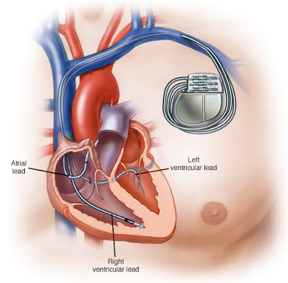
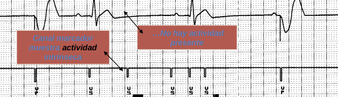

# Índice
  + ¿Cómo funciona un corazón?
  + Señales eléctricas de bombeo
  + Partes de un marcapasos
  + Latidos del corazón. Frecuencia y amplitud
  + Generador de impulsos
  + Ejemplo de las señales de un marcapasos
  + Infrasensado
  + Sobresensado

# ¿Cómo funciona un corazón?

 

# Señales eléctricas de bombeo

# Partes de un marcapasos

  + Detector de frecuencia.
  + Electrodos que conectan el detector al corazón.
  + Generador de impulsos eléctricos.
  + Batería de litio.

# Latidos del corazón. Frecuencia y amplitud I

  + Onda P. Las aurículas se contraen y expulsan la sangre a los ventrículos.
  + Complejo QRS. Los ventrículos se contraen y la sangre es enviada a todo el cuerpo.
  + Onda T. Los ventrículos se repolarizan. Es un reinicio para volver a incial el ciclo.

# Latidos del corazón. Frecuencia y amplitud II

# Generador de impulsos
  + El detector registra la frecuencia cardíaca con los electrodos.
  + El detector comunica la información al generador de impulsos.
  + El generador lanza corrientes eléctricas con la frecuencia y amplitud que necesita el corazón
para generar ondas en forma de señales contínuas que hagan latir al órgano.

# Ejemplo de las señales de un marcapasos

# Infrasensado

# Sobresensado

